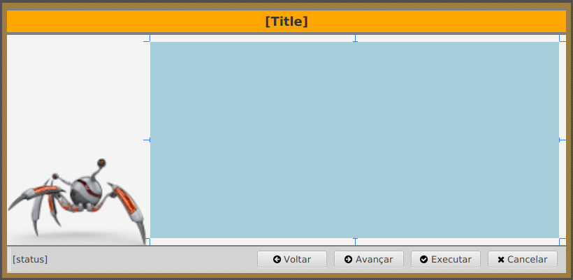

# javafx-wizard

Exemplo de aplicativo utilizando Java FX para criar um aplicativo Desktop no modelo de Wizard, que coletará informações do usuário e no final, executará uma operação.

Esse exemplo utiliza:

* [OpenJDK (Java)](https://openjdk.java.net/)
* [Maven](https://maven.apache.org/)
* [Open JFX](https://openjfx.io/)
* [Scene Builder](https://gluonhq.com/products/scene-builder/)

Há um esforço para desenvolver as classes principais de gerenciamento do Wizard e das páginas de navegação.

## Páginas

As páginas devem ser arquivos de leioute Java FX (*.fxml), que possuam uma classe de controle que herde de **br.com.spiderbot.wizard.pages.Page**.

Em **br.com.spiderbot.wizard.Wizard**, o método **initialize** pode ser utilizado para carregar as as páginas. A ordem de apresentação será definida pela ordem de registro delas.

## O Wizard



O título ([Title]) será atualizado em cada navegação com informações da página corrente.

O campo de estado de navegação [status] apresentará informações sobre operações realizada na página corrente, além de alguns íncones ao lado esquerdo indicando a navegação entre as páginas.

Os botões serão desabilitados quando não for possível executar alguma operação. O botão Excutar estará disponível apenas na última página.

A área destacada na imagem é onde as páginas de navegação serão apresentadas. O componente base é um StackPane. Procure criar as páginas de navegação do Wizard com as mesmas dimensões deste componente (content).

## Finalização

Para gerar os instaladores, deve-se fazê-lo na plataforma alvo. Por exemplo, executando no Linux, gerará um instalador padrão Debian.

```bash
mvn clean favafx:jlink jpackage:jpackage
```

No diretório ./target/dist estará um instalador do aplicativo.
